   

## 🚀 What I'm working on

- 🧠 **Machine learning on real data**: models evaluated on what they have never seen, from unseen patients to never-measured parts of a building
- ⚙️ **From model to product**: experiment tracking with MLflow, prediction APIs with FastAPI, Docker images, tests and continuous integration
- 🎓 **Exchange semester at KU Leuven** in artificial intelligence and statistics: deep learning, time series, wavelets
- 🚗 **Founder of BA Prestige Auto**, where I built the online vehicle-registration service (Next.js, Supabase, Stripe)

## 🛠️ Tech Stack

**Machine learning & data:** `PyTorch` `scikit-learn` `NumPy` `SciPy` `Time series` `Signal processing`

**MLOps:** `MLflow` `FastAPI` `Docker` `pytest` `GitHub Actions`

## 📌 Featured Projects

<table width="100%">
  <tr>
    <td width="50%" valign="top">
      <h3>❤️ <a href="https://github.com/yanis-andr/ecg-legendre">ecg-legendre</a></h3>
      
Cardiac arrhythmia detection from electrocardiograms. Each heartbeat is summarised by 13 Legendre coefficients, then the model is evaluated again on patients it has never seen, which turns a 98.6% project score into a realistic picture of what generalises.

      
    </td>
    <td width="50%" valign="top">
      <h3>✈️ <a href="https://github.com/yanis-andr/adsb-decoder">adsb-decoder</a></h3>
      
Aircraft tracking from raw software-defined-radio recordings. Demodulation, CRC check and position decoding place 23 aircraft on a map and recover all 93 reference messages. Written in MATLAB, then ported to Python and checked block by block (pair project).

      
    </td>
  </tr>
  <tr>
    <td width="50%" valign="top">
      <h3>🔬 <a href="https://github.com/yanis-andr/melanoma-cnn">melanoma-cnn</a></h3>
      
Malignant melanoma or benign lesion? A convolutional network trained from scratch in PyTorch on 11,879 skin images, reaching about 93% accuracy on 2,000 test images.

      
    </td>
    <td width="50%" valign="top">
      <h3>📡 Indoor localisation API</h3>
      
Research internship at ISEP: physics-informed neural networks that locate a person indoors from LoRa signals, cutting the error by 16% on never-measured zones. The code then became a service, with MLflow tracking and a FastAPI model in Docker. Code available on request.

      
    </td>
  </tr>
</table>

## 📊 GitHub Stats

<i>📫 Happy to talk machine learning, data engineering or end-of-studies internships starting February 2027.</i>

